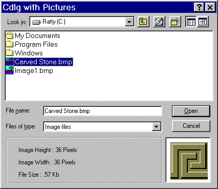



## Image Previews in Common Dialog

### Description

If you are writing an Image Editor or your app opens picture files you need this. Just like the big boys you can now show a preview of images right there in the CommonDialog window. Very easy to use. Add a module and a small form to your project and call with a single line of code.
 
### More Info
 

             |
---                |---
**Submitted On**   |2001-03-21 12:10:22
**By**             |[MrBobo](https://github.com/Planet-Source-Code/PSCIndex/blob/master/ByAuthor/mrbobo.md)
**Level**          |Intermediate
**User Rating**    |4.7 (33 globes from 7 users)
**Compatibility**  |VB 6\.0
**Category**       |[Files/ File Controls/ Input/ Output](https://github.com/Planet-Source-Code/PSCIndex/blob/master/ByCategory/files-file-controls-input-output__1-3.md)
**World**          |[Visual Basic](https://github.com/Planet-Source-Code/PSCIndex/blob/master/ByWorld/visual-basic.md)
**Archive File**   |[CODE\_UPLOAD173823212001\.zip](https://github.com/Planet-Source-Code/mrbobo-image-previews-in-common-dialog__1-21821/archive/master.zip)

